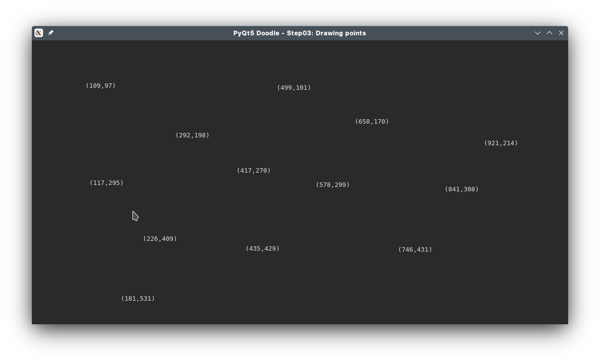

# PyQt5 Doodle Tutorial

## Step 3 - Painting in the window
In the previous step of the tutorial, we have seen how to handle events sent by the underlying operating system (OS) to your main window. Specifically, we handled the `mouse press` and the `close` events in our `MainWindow` class by providing event handler functions. In this step, we will illustrate how to handle the `paint` event.

Before we start, create a new sub-directory `step03` under our _root folder_ and copy `step02/mainWidow.py` to `step03/mainWidow.py`. Also copy `step02/step02.py` to `step03/step03.py`.

### Handling `paint` events
When a window needs to be re-painted (for example when part of the client area that was hidden before is now unhidden), the OS will send your window a `paint` event.

To handle this event, we must overload the following event handler in our `MainWindow` class:

 ```python
 def paintEvent(self, e: QPaintEvent) -> None:
     ## implementation...
 ```
 Paint events are, what I call, _lazy events_ as they are sent to your window only when repainting is required. Also, multiple `paint` events are usually combined into one `paint` event by the OS to optimize painting.

 You can also force a `paint` event to be sent to your window by calling `update()` function anywhere in your code. Calling `update()` effectively calls your `paintEvent(...)` function immediately.

 <span style="background-color: salmon; color:black">**WARNING: you SHOULD NOT call `update()` in the `paintEvent(...)` function as that will lead to infinite looping!!**</span>

### Handling Mouse Press events
In this step, we will modify the mouse press event to actually do some work. Every time the user _left mouse presses_ on the client area, we will _capture_ the mouse co-ordinates and save this to a `points[]` list so we can iterate over it and paint all the points where the user pressed the left mous button.

First let's modify the `MainWindow.__init__()` method slightly - here is the code.

```python
# step03/mainWidow.py
class MainWindow(QMainWindow):
    def __init__(self, *args, **kwargs):
        super(QMainWindow, self).__init__(*args, **kwargs)
        self.setWindowTitle("PyQt5 Doodle - Step03: Drawing points")
        self.setStyleSheet("background-color: white")
        self.setGeometry(QRect(100,100,640,480))
        # --- new lines added below
        self.modified = False
        self.points = []
```
We have added 2 class attributes to the class:
-  `self.points`, is a `list` which saves the co-ordinates [i.e. `(x, y)` location] where the left mouse is pressed. As we press the left mouse at different `(x,y)` locations within the client area, each location will get added to this list.
- `self.modified`, is a `boolean` flag to detect if the doodle has been _modified_ or not. Every time a new point is added to `self.points` list, the doodle is flagged as modified and `self.modified` is set to `True`

Here is the code to handle the `mouse press` event:
- when the `left` mouse button is pressed, we save the point where it was pressed in the `self.points` list
- when the `right` mouse button is pressed, we clear the list of points saved.

```python
# step03/mainWidow.py
class MainWindow(QMainWindow):
    ...
    # other methods omitted for brevity

    def mousePressEvent(self, e: QMouseEvent) -> None:
        if e.button() == Qt.LeftButton:
            # user pressed left mouse button - save point where
            # the mouse left button was clicked
            pt = QPoint(e.pos().x(), e.pos().y())
            self.points.append(pt)
            # flag doodle as modified
            self.modified = True
        elif e.button() == Qt.RightButton:
            # user pressed right mouse button - clear display of
            # any points saved previously
            self.points = []
            # flag the doodle as not modified
            self.modified = False

        # force repaint NOW!
        self.update()
```
**Notice that the last call in the method is `self.update()`**. This call _forces_ a repaint of the window

### Handling the `paint` event
PyQt5's 2D graphics engine is based on the `QtGui.QPainter` class, which can draw all kinds of shapes (rectangles, polygons, lines etc.), images and text. `QPainter` is used to draw on a _paint device_, which could be a class derived from `QWidget`, a `QPixmap` or a `QImage`. Incidentally, `QMainWindow` is derived from `QWidget` so can be used as a _paint device_ on which `QPainter` can draw.

All drawing must be handled in overloaded `paintEvent(self, e: QPaintEvent)` method of the `MainWindow` class. Drawing is always done between calls to `QPainter.begin(...)` and `QPainter.end(...)`. The `begin()` call initializes the `QPainter` with default parameters (e.g. default pen & brush), while the `end()` call does the cleanup of any memory allocations that happen behind the scene.

<span style="background-color:salmon; color:black">__NOTE: if you forget the `begin()` and `end()` calls, you wont see any of your custom drawings.__ This is often a mistake newbies can make, which can be really frustrating!</span>

The `begin()` call must be passed a parameter, which is an instance of the _paint device_ on which you intend to draw. In our case, we want to draw on our `MainWindow`, hence we pass in `self`

Here's our `paintEvent(...)` method:

```python
# step03/mainWidow.py
class MainWindow(QMainWindow):
    ...
    # other methods omitted for brevity
    def paintEvent(self, e: QPaintEvent) -> None:
        painter = QPainter()
        painter.begin(self)
        try:
            font = QFont("Monospace", 10)
            painter.setFont(font)

            if len(self.points) > 0:
                for pt in self.points:
                    pos = f"({pt.x()},{pt.y()})"
                    painter.drawText(pt.x(), pt.y(), pos)
        finally:
            painter.end()
```
We iterate over the points, if any, that we have _accumulated_ in the `self.points[]` list and display the co-ordinates of the point at the point's location.

__NOTE:__ I have use the `try/finally` block to ensure that `end()` is _always_ called, even if the painting code throws some sort of error/exception. This is not required, but a good practice to follow.

If you can run `step03/step03.py` now. Once the window comes up, left-mouse click all around the client area and you should see something like the screen-shot below. If you right-mouse click, all the points will disappear!



### Customizing the `closeEvent()` function
There is one small change we need to make to the `closeEvent()` method. See the code below:

```python
# step03/mainWidow.py
class MainWindow(QMainWindow):
    ...
    # other methods hidden for brevity
    def closeEvent(self, e):
        if self.modified:
            resp = QMessageBox.question(self, "Confirm Close",
                       "This will close the application.\nOk to quit?",
                       QMessageBox.Yes | QMessageBox.No, QMessageBox.No)
            if resp == QMessageBox.Yes:
                e.accept()
            else:
                e.ignore()
        else:
            e.accept()
```
Notice that the `QMessageBox.question(...)` call is now called only if `self.modified` is `True` (i.e. when the drawing is _modified_). If drawing is not modified, we just `accept()` the event, which closes the window _without_ asking the user.

<hr/>

<span style="color:blue">This completes Step3 of our tutorial</span>, where we demonstrated how `paint()` events can be handled. In the next step we will start drawing doodles.<br/>

__NOTE:__ I have written this tutorial on a Ubuntu Linux machine, so the window look & feel is specific to my OS. On a Windows machine, the look & feel will be native to Windows, and likewise on a Mac. However, you won't have to change your code - PyQt5 handles the low level stuff for you.
