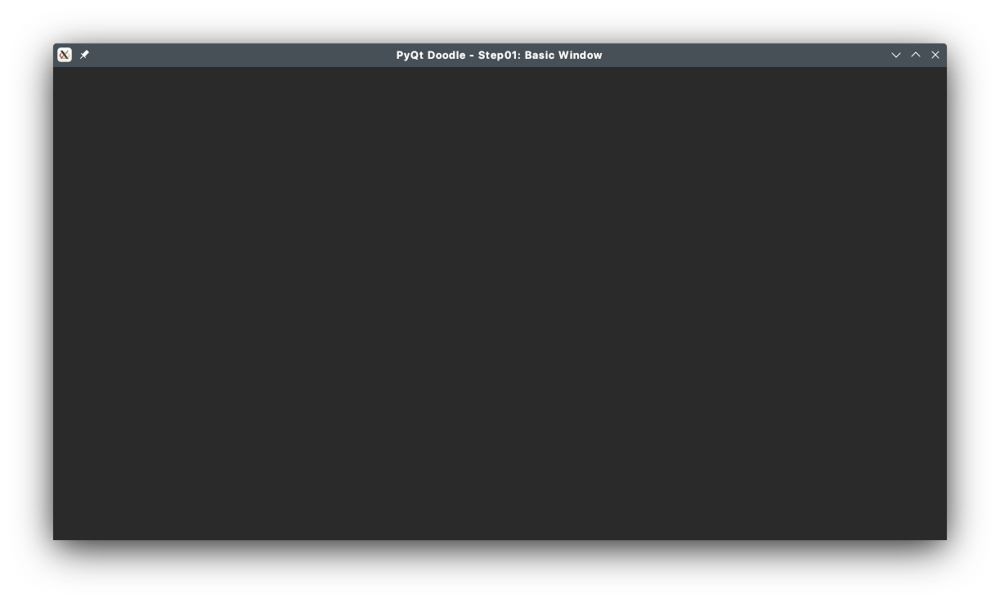

# PyQt5 Doodle Tutorial

## Step 1 - Creating the basic window
In this step, we will create the basic window within which the doodles will be drawn. Our main window will be a class derived from the `PyQt5.QtWidgets.QMainWindow` class.

In this step, the application does nothing else but display the main window, which can be minimized, maximized, resized and moved around. In the subsequent steps, we will gradually add more and more functionality to the application.

### Coding Steps
1. First create a **root directory** under which we will create sub-directories for each step of this tutorial. This folder could be created anywhere on your disk. For example, I have created a directory named `PyDoodle` under a `code` directory off my `home` directory in my Ubuntu Linux machine.<br/>
<span style="background-color:salmon; color:black">So my root directory is `~/code/PyDoodle`. **Henceforth, I'll refer to this directory as the `root directory`.**</span>
2. Next create a sub-folder `step01` under the `root directory`.
3. Fire up your favorite code editor (I use Atom) and create a new file, named `mainWindow.py`, in the `step01` directory. We will define our `QMainWindow` derived class in this file as below:

```python
# step01/mainWindow.py - main window of application

from PyQt5.QtCore import *
from PyQt5.QtGui import *
from PyQt5.QtWidgets import *

class MainWindow(QMainWindow):
    def __init__(self, *args, **kwargs):
        super(QMainWindow, self).__init__(*args, **kwargs)
        self.setWindowTitle("PyQt Doodle - Step01: Basic Window")
        # resize window to use 4/5 of the screen
        self.resize(QGuiApplication.primaryScreen().availableSize() * 4 / 5)
```

For this step, just the constructor `__init__()` method is enough. In this method, we define some customizations for the main window:
- We set the title of the main window using the `setWindowTitle()` method
- Finally, we set the initial size of the window to 4/5th of screen size.

4. Next create the Python module that will call this class & initiate the event loop. Create another file `step01.py` in the `step01` directory. Here is the code for `step01/step01.py`

```python
# step01/step01.py: driver module
import sys
from PyQt5.QtGui import *
from mainWindow import *

# code to import Chocolaf theme files
from chocolaf.palettes import ChocolafPalette
from chocolaf.utils.pyqtapp import ChocolafApp

def main():
    # NOTE: ChocolafApp is a class derived from QApplication
    app = ChocolafApp(sys.argv)
    app.setStyle("Chocolaf") # use Chocolaf theme

    mainWindow = MainWindow()
    mainWindow.show()

    sys.exit(app.exec_())


if __name__ == "__main__":
    main()
```
We import our `MainWindow` class with the `from mainWindow import *` call.

5. Run `step01.py` - it will display the following window:



This is a simple high level window which can be moved, resized, minimized, maximized and closed - but does nothing else.

<hr/>

<span style="color:blue">This completes Step1 of our tutorial.</span>  In the next step we will add code to handle operating system events.

## **NOTE**
- All code has been developed & tested on a Windows 10 and a Linux machine running KDE Plasma 5.24 (Manjaro Linux). **I have not tested this code on a Mac (as I don't own one :( )**. Screen-shots captured alternate between Windows 10 & KDE Plasma.
- The code uses a custom dark-chocolate theme (Chocolaf), developed by your's truly.
