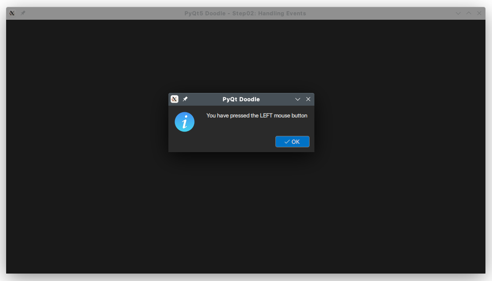
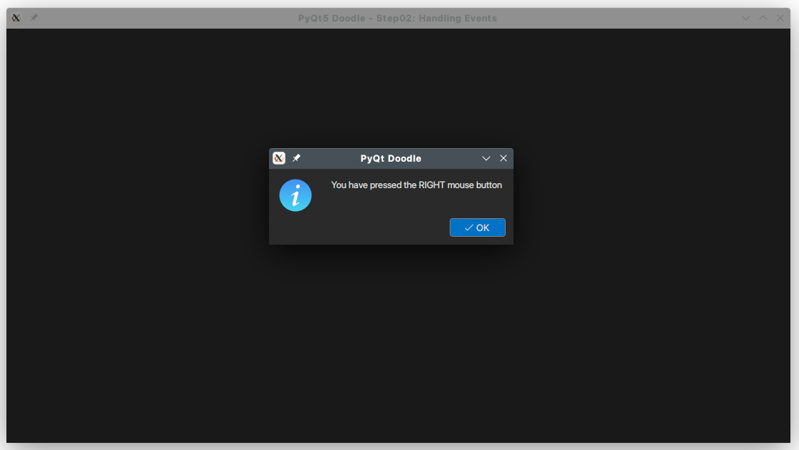
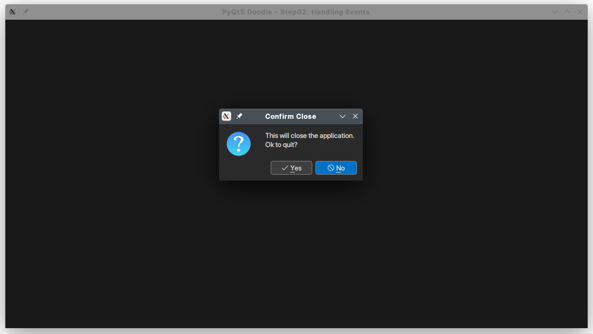

# PyQt5 Doodle Tutorial

## Step 2 - Handling Operating System Events
In the previous step of the tutorial, we created the basic top level window for the application.
In this step we will add code to handle operating system (OS) events.

Most GUI applications are event based. When you interact with a GUI application, your actions (e.g. pressing the left mouse button or dragging the mouse across the client area, selecting a menu item, clicking on a toolbar button, closing the window etc.) result in the underlying operating system sending your main window a specific `event`. For example, when the mouse is pressed over the window a `mouse press event` will be sent to the main window, when the window is closed, a `close event` will be sent, when a part of the window needs to be re-drawn a `paint` event is sent and so on.

Each `event` may include additional information specific to that event. For example, the `mouse press` will include information like the `(x, y)` co-ordinates where the mouse was clicked; the `paint` event would include information about the _area_ of the window that needs to be re-painted and so on.

Now imagine that the _event processing loop_ in our `app.exec()` call has code that reads these events from the OS. Further, depending on the event received, it _cracks open_ the additional information _enclosed_ with the event. This information is the _packaged_ in an event specific `PyQt` class which is then _dispatched_ to our main window. For example, a `mouse press` event will enclose event specific information in a `QMouseEvent` instance, from which you can get the `(x, y)` co-ordinates of the mouse click and other information that we will discuss later. A `paint` event will have information in a `QPaintEvent`, which will have information on which area needs to be re-painted and so on.

Any `PyQt` class derived from `QWidget` class can _handle events_. Our `MainWindow` class derives from `QMainWindow`, which derives from `QWidget`, so it can _handle events_. _Handling an event_ means overloading a function, with a specific function signature in our derived class. As you can imagine, `QWidget` will have code (generic) to reasonably handle all possible OS events. When we provide an _event handler_ in our derived class, the magic of _inheritance_ results in _our_ function getting called. We can choose to _ignore_ and event; in which case we _will not_ overload the _event handler_ function. In this case (you guessed it!), the `QWidget` provided code will get called, which provides reasonable default response.

Ok, enough theory. Let's get to the code now.

In this step we will provide event handlers for the `mouse press` and `close` events. Specifically,
- When the _left mouse button_ is pressed over the window, we will _handle_ this event and display a message box to the user informing her that the "left mouse button was pressed".
- Similarly, when the _right mouse button_ is pressed over the window, we will _handle_ this event and display a message box to the user informing her that the "right mouse button was clicked".
- When the window is closed, e.g. by clicking the `X` button on the title bar, we will _handle_ this event and ask the user if she wants to quit the application. Should she confirm, the window is closed. Since this is the _main window_ of our application, the application will also close.

This is obviously very rudimentary behavior, but suffices for the purpose of illustrating how OS events can be handled in a `PyQt5` application. In the following steps, we will add relevant behavior (e.g. drawing lines as the mouse is dragged across the window and so on).

For a comprehensive coverage see [Event Handlers Qt Documentation](https://doc.qt.io/qtforpython/overviews/eventsandfilters.html)

### Coding the changes
1. Create a separate folder `step02` in the root folder and copy `step01/mainWindow.py` to this folder - this will serve as a _starter_ file, which we will modify here.
2. Similarly copy `step01/step01.py` to `step02/step02.py`

#### Handling `mousePress` Events
To handle both the left and right mouse press events, we __must__ provide a function with the following signature in our `MainWindow` class

```python
def mousePressEvent(self, e : QMouseEvent) -> None:
    # function implementation....
```

__NOTE:__ The function signature must be exactly as shown above. We are using [Function Annotations](https://www.python.org/dev/peps/pep-3107/), available in Python 3.

Add the following code to your `MainWindow` class in `step02/mainWindow.py` module.

```python
# step02/mainWindow.py - main window class
class MainWindow(QMainWindow):
    # other functions & initializers (omitted for brevity)

    def mousePressEvent(self, e: QMouseEvent) -> None:
        if e.button() == Qt.LeftButton:
            QMessageBox.information(self, "PyQt Doodle",
                                    "You have pressed the LEFT mouse button")
        elif e.button() == Qt.RightButton:
            QMessageBox.information(self, "PyQt Doodle",
                                    "You have pressed the RIGHT mouse button")        
```

The `QMouseEvent` includes additional information, like _which mouse button_ was pressed, where the button was pressed etc. In this step the _which button_ information suffices. This is detected using the `e.button()` call, which returns values like `Qt.LeftButton`, `Qt.RightButton`, `Qt.MiddleButton` which are self explanatory. We check which mouse button was pressed and inform the user accordingly. We use the `QMessageBox.information(...)` function to do so as shown above.

You can get more information about using `QMessageBox` [here](https://www.tutorialspoint.com/pyqt/pyqt_qmessagebox.htm)

__We don't need to make any changes to `step02.py`__. This is just a copy of `step01/step01.py`.

Running `step02/step02.py` will display the following output when the left mouse button is pressed over the client area of the window:



Similarly, when the right mouse button is pressed over the client area of the window, you'll observe the following:



#### Handling the `close` event
To handle the `close event`, we __must__ provide a function with the following signature in our `MainWindow` class

```python
def closeEvent(self, e : QCloseEvent) -> None:
    # function implementation....
```

Add the following method to our `MainWindow` class in `step02/mainWindow.py` file:

```python
# step02/mainWindow.py
class MainWindow(QMainWindow):
    # rest of the functions omitted for brevity...

    def closeEvent(self, e: QCloseEvent) -> None:
        # ask user is she/he wants to quit
        resp = QMessageBox.question(self, "Confirm Close",
                                    "This will close the application.\nOk to quit?",
                                    QMessageBox.Yes | QMessageBox.No, QMessageBox.No)
        if resp == QMessageBox.Yes:
            e.accept()
        else:
            e.ignore()

```
A few points to note:
- The first thing we do is ask the user if she wants to close the window & exit the application. We use the `QMessageBox.question(...)` call for the same.
- If the user clicks `Yes` on the message box displayed, we accept the event `e.accept()`. Accepting a `close` event usually implies closing the window and quitting the application.
- Conversely, if the user clicks the `No` button, we ignore the event `e.ignore()`. Ignoring an event means _don't process this event_, which in our case would imply _don't quit the application yet_.

**NOTE:** the `e.ignore()` is another way you can _programattically_ ignore an event. This call us usually used in an event handler, where you want to ignore the event in response to a specific condition. In our case, we ignore the event if user chooses `No`.

After adding this new method to the `MainWindow` class, run `step01.py`. When the main window is displayed, click on the `X` button on the title bar. You should see the following message box.



- Clicking on the `No` button will do nothing (as our event is ignored)
- Clicking on the `Yes` button will close the main window and exit the application.

<hr/>

<span style="color:blue">This completes Step2 of our tutorial.</span> In the next step, we will add code to draw text in the client area when the mouse button is pressed.

## **NOTE**
- All code has been developed & tested on a Windows 10 and a Linux machine running KDE Plasma 5.24 (Manjaro Linux). **I have not tested this code on a Mac (as I don't own one :( )**. Screen-shots captured alternate between Windows 10 & KDE Plasma.
- The code uses a custom dark-chocolate theme (Chocolaf), developed by your's truly.
