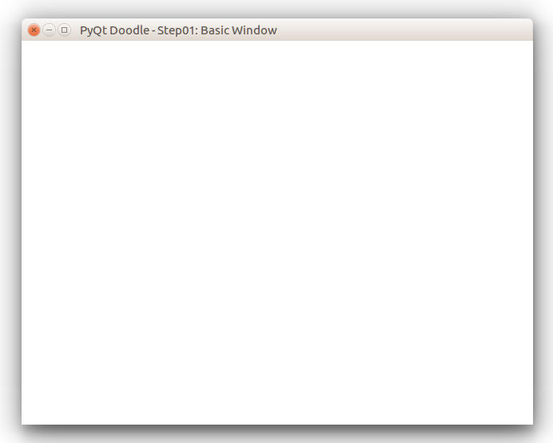

# PyQt5 Doodle Tutorial

## Step 1 - Creating the basic window
In this step, we will create the basic window within which the doodles will be drawn. Our main window will be a class derived from the `PyQt5.QtWidgets.QMainWindow` class.

Fire up your favourite editor (I use Atom) and create a new file (names `drawWindow.py`) in which we define our `QMainWindow` derived class as below

```python
from PyQt5.QtCore import *
from PyQt5.QtGui import *
from PyQt5.QtWidgets import *

class DrawWindow(QMainWindow):
    def __init__(self, *args, **kwargs):
        super(QMainWindow, self).__init__(*args, **kwargs)
        self.setWindowTitle("PyQt Doodle - Step01: Basic Window")
        self.setStyleSheet("background-color: white")
        self.setGeometry(QRect(100,100,640,480))

```

For this step, just the constructor `__init__()` method is enough. In this method, we define some customizations for the main window:
- We set the title of the main window using the `setWindowTitle()` method
- We also set the background color of the client area of the window using the `setStyleSheet()` function
- Finally, we set the initial size of the window using the `setGeometry()` call.

Next create the Python module that will call this class & initiate the event loop. In your favourite editor create another file `step01.py` in the same folder as the `drawWindow.py` file. Here is the code for `step01.py`

```python
# step01.py
import sys
from PyQt5.QtGui import *
from drawWindow import *

def main():
    app = QApplication(sys.argv)

    mainWindow = DrawWindow()
    mainWindow.show()

    return app.exec_()

if __name__ == "__main__":
    main()
```
We import our `DrawWindow` class with the `from drawWindow import *` call.

Running `step01.py` above displays the following window:



This is a simple high level window which can be moved, resized, minimized, maximized and closed - but does nothing else.

__NOTE:__ I am writing this tutorial on a Ubuntu Linux machine, so the window look & feel is specific to my OS. On Windows the window will show the _native_ Windows look & feel and likewise on a Mac - there is no change in the code above!

This ends `step01`, where we create a basic top level window. In the next step we will add code to handle operating system events.
