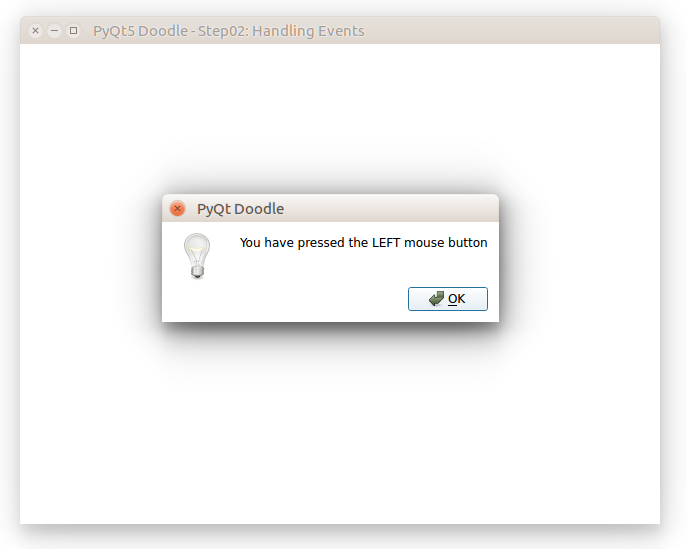
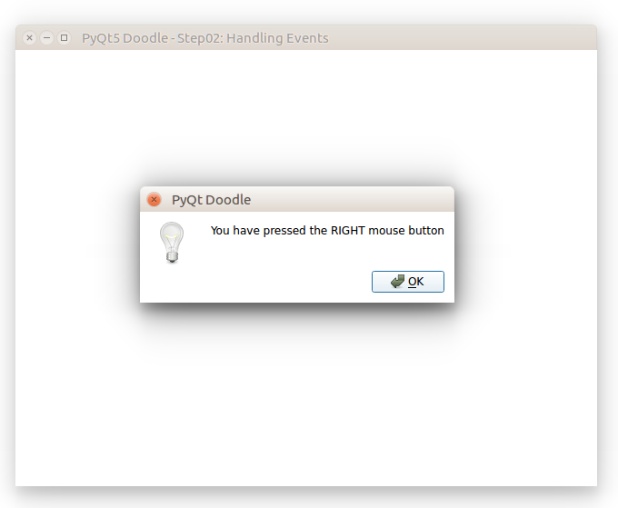

# PyQt5 Doodle Tutorial

## Step 2 - Handling Operating System Events
In the previous step of the tutorial, we created the basic top level window for the application.
In this step we will add code to handle operating system (OS) events.

Most GUI applications are event based. When you interact with a GUI application, your actions (e.g. pressing the left mouse button or dragging the mouse across the client area, selecting a menu item, clicking on a toolbar button, closing the window etc.) result in the underlying operating system sending your main window `events` - the event is specific to the action you have just taken. For example, when the mouse is pressed over the window a `mouse press event` will be sent to the main window, when the window is closed, a `close event` will be sent and so on.

Each GUI application has an _event processing loop_, which scans for all events sent to the main window by the underlying OS. It _may choose_ to _handle_ certain events, while most events are _ignored_. _Handling an event_ usually involves providing an _event handling_ function in your window class, which the _event processing loop_ will _automatically_ call. The _ignored_ events fall back to the OS, which provides a reasonable default behavior.

The _event processing loop_ is part of our `app.exec_()` call, which (if you recall) is the last function you call in your `main()` function. This _kicks in_ the event processing loop for our main window - the nitty-gritties are handled internally by PyQt and the good news is that we need not be concerned with the low level implementation. Also, this works across all operating systems on which PyQt is supported.

In this step we will add code to handle `mouse press` and `close` events. Specifically,
- When the _left mouse button_ is pressed over the window, we will _handle_ this event and display a message box to the user informing her that the "left mouse button was pressed".
- Similarly, when the _right mouse button_ is pressed over the window, we will _handle_ this event and display a message box to the user informing her that the "right mouse button was clicked".
- When the window is closed, e.g. by clicking the `X` button on the title bar, we will _handle_ this event and ask the user if she wants to quit the application. Should she confirm, the window is closed and application exits.

This is obviously very rudimentary behavior, but suffices for the purpose of illustrating how OS events can be handled. In the following steps, we will add more relevant behavior (e.g. drawing lines as the mouse is dragged across the window and so on).

For a comprehensive coverage see [Event Handlers Qt Documentation](https://doc.qt.io/qtforpython/overviews/eventsandfilters.html)

### Handling `mousePress` Events
To handle both the left and right mouse press events, we __must__ add the following function to the implementation of our `DrawWindow` class (in the `drawWindow.py` module).

__NOTE:__ The function signature must be exactly as shown below. We are using [Function Annotations](https://www.python.org/dev/peps/pep-3107/), which are available in Python 3.

```python
class MainWindow(QMainWindow):
    # other functions & initializers omitted...

    def mousePressEvent(self, e: QMouseEvent) -> None:
        if e.button() == Qt.LeftButton:
            QMessageBox.information(self, "PyQt Doodle",
                                    "You have pressed the LEFT mouse button")
        elif e.button() == Qt.RightButton:
            QMessageBox.information(self, "PyQt Doodle",
                                    "You have pressed the RIGHT mouse button")        
```

When the mouse button is pressed over the window, an instance of `QMouseEvent` event is sent to the window. This event encapsulates additional information, like which mouse button was pressed, co-ordinates of mouse position relative to the window receiving the event and the screen and so on.

In this step, we are interested in knowing which mouse button was pressed. The `button()` method of the `QMouseEvent` returns a value of type `Qt.MouseButton`, which can take several values like `Qt.LeftButton`, `Qt.RightButton`, `QtMiddleButton`. We check which mouse button was pressed and inform the user accordingly. We use the `QMessageBox.information(...)` function to do so.

Running `step01.py` as we did in Step01 produces the following output when the left mouse button is pressed over the client area of the window:



Similarly, when the right mouse button is pressed over the client area of the window, you'll observe the following:



### Handling the `close` event
To handle the close event, you guessed it, we need to add another funtion to our `DrawWindow` class implementation. Add the following method to our class:

```python
def closeEvent(self, e: QCloseEvent) -> None:
    # ask user is she/he wants to quit
    resp = QMessageBox.question(self, "Confirm Close",
                                "This will close the application.\nOk to quit?",
                                QMessageBox.Yes | QMessageBox.No, QMessageBox.No)
    if resp == QMessageBox.Yes:
        e.accept()
    else:
        e.ignore()

```
A few points to note:
- The event handler function should be called `def closeEvent(self, e: QCloseEvent) -> None`
- The first thing we do is ask the user if she wants to close the window & exit the application. We use the `QMessageBox.question(...)` call for the same.
- If the user clicks `Yes` on the message box displayed, we accept the event `e.accept()`. Accepting a `close` event usually implies closing the window and quitting the application.
- Conversely, if the user clicks the `No` button, we ignore the event `e.ignore()`. Ignoring an event means _don't process this event_, which in our case would imply _don't quit the application yet_.

After adding this new method to the `DrawWindow` class, run `step01.py`. When the main window is displayed, click on the `X` button on the title bar. You should see the following message box.


- Clicking on the `No` button will do nothing (as our event is ignored)
- Clicking on the `Yes` button will close the main window and exit the application.

This completes Step2 of our tutorial. In the next step, we will add code to draw text in the client area when the mouse button is pressed.

__NOTE:__ I am writing this tutorial on a Ubuntu Linux machine, so the window look & feel is specific to my OS. On Windows the window will show the _native_ Windows look & feel and likewise on a Mac - there is no change in the code above!
