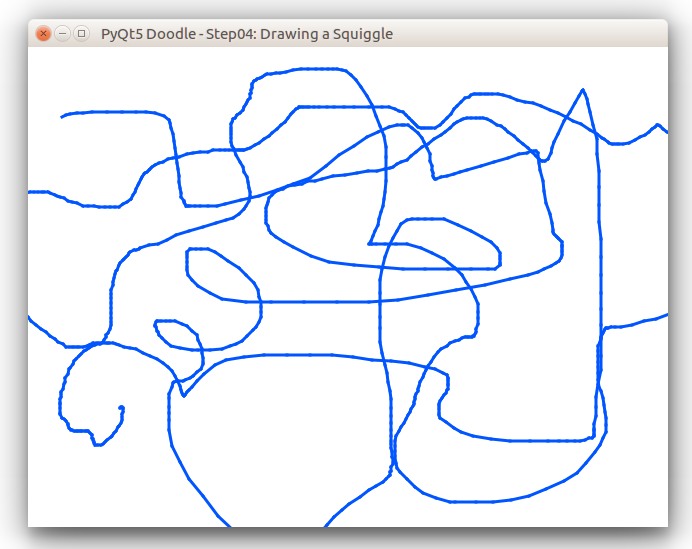

# PyQt5 Doodle Tutorial

## Step 4 - Drawing a Squiggle
So far we have built up our GUI nicely. We have progressively developed an application that handles
mouse press messages and paint messages. Now we will "connect-the-dots", so to speak, and begin the
actual doodling process. In this step, we will show you how to draw a squiggle - a wavy line that
will follow your mouse-drag actions.

To draw a squiggle, we'll need to _handle_ the following messages:
- `mouse press event` - for the left mouse button, which will _initiate_ the operation
- `mouse drag event` - for the left mouse button, which will actually draw the squiggle
- `mouse release event` - which will _end_ the squiggle draw process

We have already seen how to handle the `mouse press` event before. In this step, we will be modifying our `mouse press`
event handler to _initiate_ the operation of drawing a squiggle. The `mouse drag` and `mouse release` events are new to this step. These are explained below.

The `mouse drag` event is sent to your event handler class when the mouse is _dragged_ after a `mouse press`. For example, when you press the left mouse button & then drag the mouse across the window _keeping the left mouse button pressed_. Similarly, you will also receive the `mouse drag` event if you _drag_ the right mouse button.

**NOTE: for the window to receive `mouse drag` events, you must _enable mouse tracking_ by calling `setMouseTracking(True)` before you _expect_ any mouse events.** A good place to call `setMouseTracking(True)` would be in your window's `__init__()` function.

A `mouse release` event is sent when the mouse button is released. This is the _oppisite_ of the `mouse press` event. A `mouse release` event will be sent when either the left or the right mouse button is released _after_ it is first pressed.

Before we start, create a new sub-directory `step04` under our _root folder_ and copy `step03/drawWindow.py` to `step04/drawWindow.py`. Also copy `step03/step03.py` to `step04/step04.py`.

### Coding the events

Before we start, create a new sub-directory `step04` under our _root folder_ and copy `step03/drawWindow.py` to `step04/drawWindow.py`. Also copy `step03/step03.py` to `step04/step04.py`.

#### Modifying the `__init__()` function
First, we need to make some modifications to the _constructor_ of our `DrawWindow` class. The modified `__init__()` function is shown below:

```python
# step04/drawWindow.py
class DrawWindow(QMainWindow):
    def __init__(self, *args, **kwargs):
        super(QMainWindow, self).__init__(*args, **kwargs)
        self.setWindowTitle("PyQt5 Doodle - Step04: Drawing a Squiggle")
        self.setStyleSheet("background-color: white")
        self.setGeometry(QRect(100,100,640,480))
        self.modified = False
        self.points = []
        # new code....
        self.dragging = False
        self.penColor = QColor(qRgb(0, 85, 255))
        self.penWidth = 3
        self.setMouseTracking(True)
```
We have added the last 4 lines in the code above:
- `self.dragging = False` : adds a boolean attribute `dragging` to the class as a flag that helps us determine if the mouse is being dragged (=True) or not (=False). You'll see how this is used when we code the `mouse` events.
- `self.penColor` and `self.penWidth` are two attributes that determine the squiggle's color and thickness respectively.
- The last line enables mouse tracking, as explained above. If you forget to add this, our `DrawWindow` will not receive any events when the mouse is _dragged_.

#### Modifying the `mouse press` function
We will modify the `mouse press` function as follows:
- When the _left_ mouse button is pressed, we will _initiate_ the process of drawing the squiggle.
- When the _right_ mouse button is pressed, we will _delete_ the squiggle.

Here are the changes:
```python
# step04/drawWindow.py
class DrawWindow(QMainWindow):
    ...
    # other functions omitted for brevity
    def mousePressEvent(self, e: QMouseEvent) -> None:
        if e.button() == Qt.LeftButton:
            # clear any previous squiggle
            self.points = []
            # start a new squiggle
            pt = QPoint(e.pos().x(), e.pos().y())
            self.points.append(pt)
            self.modified = True
            self.dragging = True
        elif e.button() == Qt.RightButton:
            self.points = []
            self.modified = False
            self.update()
```
This function is almost similar to the one in the previous step - when the left mouse button is pressed, we capture the point where it is pressed and save the co-ordinates to our `self.points[]` list & set the `modified` flag. We also set the `dragging` attribute to `True` in anticipation of the mouse being dragged. Code to handle the right mouse press is exactly the same as in the previous step.

### Adding the `mouse drag` event handler
To _handle_ the `mouse drag` event, we need to overload the `def mouseMoveEvent(self, e: QMouseEvent) -> None:` function in our class. Here is the code:

```python
# step04/drawWindow.py
class DrawWindow(QMainWindow):
    ...
    # other functions omitted for brevity
    def mouseMoveEvent(self, e: QMouseEvent) -> None:
        if (e.buttons() == Qt.LeftButton) and (self.dragging):
            pt = QPoint(e.pos().x(), e.pos().y())
            #print(f"Got mouseMoveEvent event at ({pt.x()}, {pt.y()})")
            self.points.append(pt)
            self.update()
        else:
            e.accept()
```
The first line check if the left mouse is already pressed and we are dragging -> `if (e.buttons() == Qt.LeftButton) and (self.dragging)`. If this condition is satisfied, then we save the current mouse co-ordinates and force a repaint (the squiggle drawing is left to the `paintEvent()`).

### Adding the `mouse release` event handler
The `mouse release` event is where we _stop_ drawing the squiggle. To _handle_ the `mouse release` event, we need to overload the `def mouseReleaseEvent(self, e: QMouseEvent) -> None` function in our class. Here is the code:

```python
# step04/drawWindow.py
class DrawWindow(QMainWindow):
    ...
    # other functions omitted for brevity
    def mouseReleaseEvent(self, e: QMouseEvent) -> None:
        if (e.button() == Qt.LeftButton) and (self.dragging):
            pt = QPoint(e.pos().x(), e.pos().y())
            self.points.append(pt)
            #print(f"Got mouseReleaseEvent event at ({pt.x()}, {pt.y()})")
            self.dragging = False
            self.update()
        else:
            e.accept()
```
Apart from saving the point where the mouse was released, this function sets the `dragging` attribute to `False` indicating that we are _done_ with drawing the squggle.

### Drawing the squiggle
So far, the mouse events have _collected_ all the points that form the squiggle. Drawing the squiggle is left to our `paintEvent()` handler. This code is shown below:

```python
# step04/drawWindow.py
class DrawWindow(QMainWindow):
    ...
    # other functions omitted for brevity
    def drawSquiggle(self, painter):
        if len(self.points) > 0:
            #print(f"In drawLine() function - drawing points {self.points}")
            pen = QPen(self.penColor, self.penWidth)
            painter.setPen(pen)
            lastPt = None
            for i, pt in enumerate(self.points):
                if i > 0:
                    painter.drawLine(lastPt, pt)
                lastPt = pt

    def paintEvent(self, e: QPaintEvent) -> None:
        painter = QPainter()
        try:
            painter.begin(self)
            painter.setRenderHint(QPainter.Antialiasing, True)
            self.drawSquiggle(painter)
        finally:
            painter.end()
```
- The `paintEvent()` function _turns on_ anti-aliasing, with the `setRenderHint(...)` call - this ensures that smoother squiggles are drawn. Then it calls a _helper_ function `drawSquiggle()` which draws the squiggle.
- The `drawSquiggle(...)` function first creates a _pen_ to draw the squiggle using the attributes `penWidth` and `penColor`, which we set in the `__init__()` method. Next it iterates over the points that we _accumulated_ across our `mouse press`, `mouse drag` and `mouse release` event handlers and _connects_ them together which will result in a curly line drawn across the window.

This completes our code to draw a squiggle. You can now run the `step04/step04.py` file - we did not make any changes to this file.
- Once the main window comes up, left-mouse-press anywhere in the client area and drag the mouse randomly around the client. A blue squiggle will be drawn as you move the mouse around.
- Release the mouse to stop drawing the squiggle. Your squiggle may look something like the one shown below.



- When you click the left mouse again, the last drawn squiggle will be erased and a new one will be drawn.

<hr/>

<span style="color:blue">This completes Step4 of our tutorial</span>, where we demonstrated how you can handle `mouse` events to draw a squiggle in the window. In the next step, we will add the ability to change the color and thickness of the squiggle.

<br/>

__NOTE:__ I have written this tutorial on a Ubuntu Linux machine, so the window look & feel is specific to my OS. On a Windows machine, the look & feel will be native to Windows, and likewise on a Mac. However, you won't have to change your code - PyQt5 handles the low level stuff for you.
